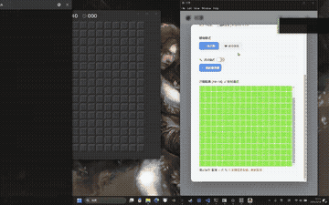
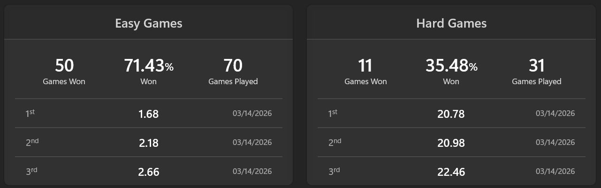
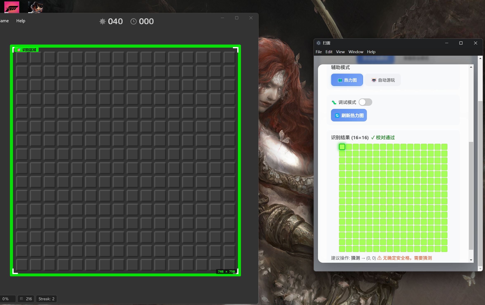

# 🎮 Minesweeper — 智能扫雷

一个全栈扫雷游戏，集成智能求解器辅助预测和自动化测试功能，内置原生扫雷游戏并可借助识别框（可拉伸）辅助游玩其它来源扫雷游戏，应用具有web与GUI两种使用方式（游玩其它来源扫雷游戏时推荐使用GUI）。




## 求解器胜率情况（辅助强度）

扫雷游戏内置两种规则

|Difficulty|SolverTest (1-cell)|Backend (3×3 safe)|Δ (pp)|
|--|--|--|--|
|beginner|90.40%|95.80%|+5.40|
|intermediate|77.90%|86.60%|+8.70|
|expert|39.20% |45.90%|+6.70 |

SolverTest = first click: single cell safe (mine relocated)
Backend    = first click: 3×3 safe zone, always blank (0)
Δ (pp)     = Backend win rate - SolverTest win rate (percentage points)

在微软商店中下载的`Minesweep`游戏中以`245ms`间隔操作鼠标（再快可能导致点击失灵，因此有硬性延迟）可极速完成游戏，超越绝大部分玩家。下图中胜率可忽略，大部分为作者本人手玩结果


## 技术栈

| 层 | 技术 | 版本 |
|---|------|------|
| **后端** | Spring Boot / Java / jlink | 4.0.2 / 25 |
| **前端** | React / TypeScript / Vite / Electron | 19 / 5.8 / 6.3 / 35 |
| **打包** | electron-builder / Powershell | Windows Portable EXE |
| **数据库** | H2 (本地文件) | — |
| **其他** | Jackson 3.x, Java Robot (自动化) | — |

## 项目结构

```text
minesweep/
├── minesweepBackend/   # Spring Boot 后端 (含原生游戏、智能求解器 + 外部屏幕识别与控制)
├── minesweepFrontend/  # React / Electron 桌面端前端 (含透明悬浮窗)
├── build.ps1           # 一键自动构建及打包脚本 (生成免安装 EXE)
├── run.ps1             # 快速启动代理脚本 (PowerShell)     可忽略
└── run.bat             # 快速启动代理脚本 (CMD)            可忽略
```

## 功能特性

### �️ 外部游戏辅助悬浮窗 (External Assist)
- 屏幕捕捉与图像识别：自动扫描并在屏幕上识别扫雷游戏区域与状态（支持 16×16 等规则网格）
- Electron 透明悬浮窗：直接在外部应用上方覆盖渲染概率热力图、安全格高亮标记
- 自动化控制：内置 Java Robot 鼠标操控，可选择让 AI 自动“点击最安全格”或在必要时“智能猜雷”




### 🕹️ 原生内建游戏
- 三种难度：简单 (9×9, 10雷)、中等 (16×16, 40雷)、困难 (16×30, 99雷)
- 首次点击必定安全 (空白格 + 自动扩散)
- 右键标旗、计时器、剩余雷数显示

### 🤖 智能辅助求解器 (ExpertSolver)
- 基于确定性推理与概率计算的 Java 原生求解器算法 (支持所有难度)
- **手动/自动 预测**：可在任意状态下刷新显示所有未知格的“安全概率热力图”
- 自动测试评估体系：内建算法效果可验证的性能基准

### 🧪 求解器自动化测试
- 命名测试批次，自动运行 100 局游戏
- 实时进度条 + 轮询状态
- 记录胜率、平均/最长/最短耗时
- 历史测试结果持久化，可滚动查看

### 👤 用户系统
- JWT 无状态认证 
- SHA-256 × 1000 轮 + 随机盐值密码哈希
- 注册/登录，默认用户 `magichear` / `111`
- 前端 Token 自动管理，401 自动登出

### 📊 统计面板
- 全局总局数 & 胜率
- 各难度详细统计：总局/总胜/胜率/最大连胜/最快/最慢用时
- Top 3 最快通关记录
- 求解器测试历史记录

## 快速开始

### 前置条件（仅开发者构建时需要）

- 系统：Windows 10/11
- 构建依赖：**JDK 25+**（用于 Maven / jdeps / 裁剪 jlink）
- 构建依赖：**Node.js 18+** & npm
- 注意：**最终生成的打包产物无需任何本地 Java 或 Node.js 环境即可直接免安装运行**

### 构建命令

```powershell
# 一键自动构建（执行前端编译 -> 资源同步 -> 后端打包 -> JRE裁剪 -> Electron打包为单文件EXE）
.\build.ps1
```

或手动构建：

```powershell
# 前端
cd minesweepFrontend
npm install
npm run build

# 后端 (含测试)
cd minesweepBackend
.\mvnw.cmd package
```

### 运行

构建完成后，最终产物位于目录中：`dist/MinesweepAssist.exe`

这是一个完整的**绿色单文件携带包 (Portable EXE)**。
它在内部集成了：
- 编译好的 Vite 前端页面 (React)
- 包含图像识别与求解算法的 Spring Boot (`.jar`) 后端
- 通过 `jlink` 精简过的迷你 Java 运行时
- Electron 桌面容器

**双击该 EXE 文件**（或使用工程根目录的 `run.bat` / `run.ps1`）即可直接启动应用，自动在后台拉起无窗口形态的 Java 服务并开启前端主界面视图。

**注意**：先前打包的web端静态文件仍存在于后端资源中，因此也可通过浏览器本地`8080`端口访问游戏的web界面

### 开发模式

```powershell
# 终端 1: 后端
cd minesweepBackend
.\mvnw.cmd spring-boot:run

# 终端 2: 前端 (Vite dev server, 端口 5173, 自动代理 /api → 8080)
cd minesweepFrontend
npm run dev
```

## API 接口

### 认证 (无需 Token)
| 方法 | 路径 | 说明 |
|------|------|------|
| POST | `/api/auth/login` | 登录 |
| POST | `/api/auth/register` | 注册 |

### 游戏 (需 Bearer Token)
| 方法 | 路径 | 说明 |
|------|------|------|
| POST | `/api/game/new` | 创建新游戏 |
| GET  | `/api/game/{id}` | 获取游戏状态 |
| POST | `/api/game/{id}/reveal` | 揭开格子 |
| POST | `/api/game/{id}/flag` | 切换旗帜 |
| POST | `/api/game/{id}/predict` | 求解器预测 |

### 统计 (需 Bearer Token)
| 方法 | 路径 | 说明 |
|------|------|------|
| GET | `/api/stats` | 获取全部统计 |

### 求解器测试 (需 Bearer Token)
| 方法 | 路径 | 说明 |
|------|------|------|
| POST | `/api/ai-test/start` | 启动测试 |
| GET  | `/api/ai-test/status/{id}` | 查询进度 |
| GET  | `/api/ai-test` | 获取所有历史记录 |

## 测试

```powershell
cd minesweepBackend
.\mvnw.cmd test
```

可选参数 `-Psolver-eval` ，加入后则包含隐藏的求解器性能测试

## 后续计划

- 前端Electron过于庞大，后续考虑进一步裁剪或改用其它更轻量化的客户端
- 优化“其它辅助”中，“猜测停手”的判断逻辑，尽量减少“跳远”操作
- 求解器在最终决策层引入MCS，提高决策质量


## 许可

MIT
